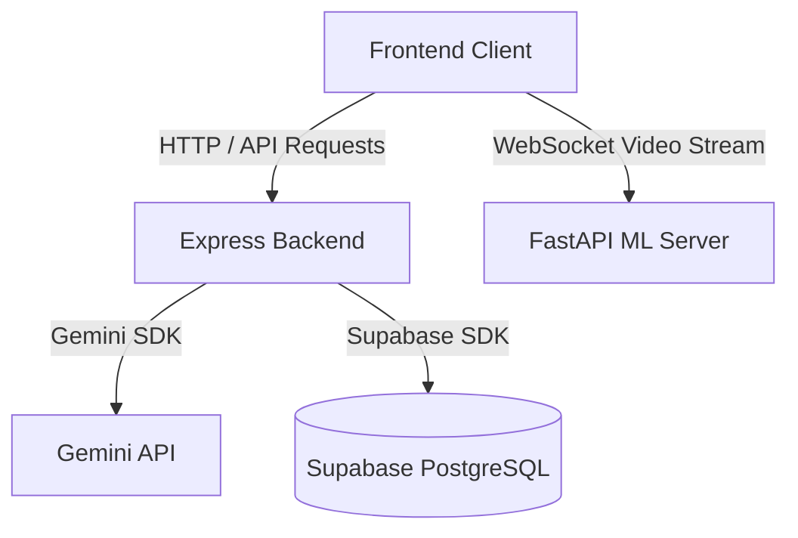

# CommuLab AI Model Server

The Machine Learning API server that performs text classification for empathy levels and question types, and handles live video streams for facial expression evaluation.

Frontend [here](https://github.com/aipsychotutor/tutor-ai-psy-frontend) | Backend [here](https://github.com/aipsychotutor/tutor-ai-psy-backend)

[](https://www.python.org/)
[](https://fastapi.tiangolo.com/)
[](https://pytorch.org/)
[](https://ultralytics.com/)

CommuLab AI Model Server processes communication inputs to evaluate therapy styles. It features dual text classification models for empathy and question categorization, and maintains a WebSocket handler to parse counselor facial expression video frames in real-time.

## Features

- **Empathy Classification:** NLP models mapping counselor sentences into precise empathy scoring levels.
- **Question-Type Categorization:** Processes text inputs to classify them as open-ended questions, closed-ended questions, reflections, or encouragements.
- **Real-Time Facial Expression Recognition:** A WebSocket server endpoint (`/ws`) which receives binary image frame data, processes them using a custom YOLOv8 model, and logs client emotions.
- **Parallel Text Classification:** High-throughput batch classification API route for bulk transcript processing (`/predict-dual-batch`).

## System Architecture



## Tech Stack

- **Web Server:** FastAPI, Uvicorn
- **Deep Learning:** PyTorch
- **Computer Vision:** Ultralytics YOLOv8
- **Image Processing:** Pillow (PIL)
- **Protocol:** Websockets

## Getting Started

### Prerequisites

- Python (version 3.10 or higher)
- pip (Python Package Installer)

### Installation

1. Navigate to the model server directory:
   ```bash
   cd tutor-ai-psy-ai-model-server
   ```
2. Initialize and activate a virtual environment:
   * **Windows PowerShell:**
     ```powershell
     python -m venv venv
     .\venv\Scripts\Activate.ps1
     ```
   * **Windows CMD:**
     ```cmd
     python -m venv venv
     .\venv\Scripts\activate.bat
     ```
   * **Linux/macOS:**
     ```bash
     python3 -m venv venv
     source venv/bin/activate
     ```
3. Install package dependencies:
   ```bash
   pip install -r requirements.txt
   ```

### Running the Server

Execute the API server entrypoint script:
```bash
python predict_api.py
```
By default, the server will start on `http://localhost:8000`.

## API Endpoints

- `POST /predict-dual` - Classify empathy and question type for a single string.
- `POST /predict-dual-batch` - Classify empathy and question types for a batch of strings (maximum 100).
- `POST /predict-question` - Classify question type only.
- `POST /predict-empathy` - Classify empathy level only.
- `WS /ws` - WebSocket endpoint for streaming video frames for live YOLO facial expression logging.

## Project Structure
```
tutor-ai-psy-ai-model-server/
├── face_emotion_detection/     # Facial emotion recognition model weights
├── predict_api.py              # Main FastAPI application & WebSocket handlers
├── requirements.txt            # Python dependencies manifest
└── venv/                       # Local Python virtual environment
```

## Future Improvements
- Optimizing YOLOv8 model inference times for low-latency client environments.
- Expanding training datasets to support a wider array of communication tone variations.
- Integration of unit testing modules for endpoint assertions.

## Author
Developed and maintained by the CommuLab Team.